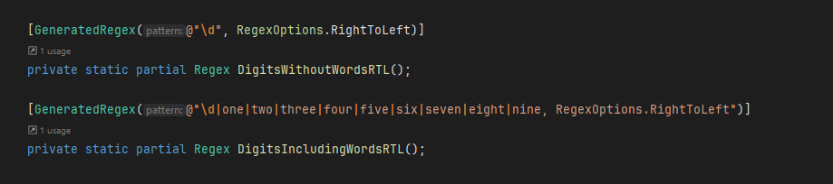

# Day 1 - Trebuchet?!

This was the hardest day-one challenge that I've ever seen in AoC.
Hopefully the others don't follow suit!

My solution uses a hybrid of Regex matching and in-code pattern matching.
Regular expressions are used to extract individual digits / "digit words", and a switch expression converts any resulting words back into digits.
Everything is kept as a string until the two digits are concatenated, and then the final calibration value is parsed into an integer.

I handled part 2 by using an obscure feature of .NET's RegEx engine - [the RightToLeft option](https://learn.microsoft.com/en-us/dotnet/api/system.text.regularexpressions.regex.righttoleft?view=net-8.0).
This causes the engine to search the string in reverse, from end to start.
Processing the input in this way ensure that we get the *other* part of any overlaps, with the expense of an entire second pass.
Once for the left-to-right read, and again for right-to-left.
Not very efficient, but simple and effective!

Also, I totally got stuck on what turned out to be a copy-paste error:

